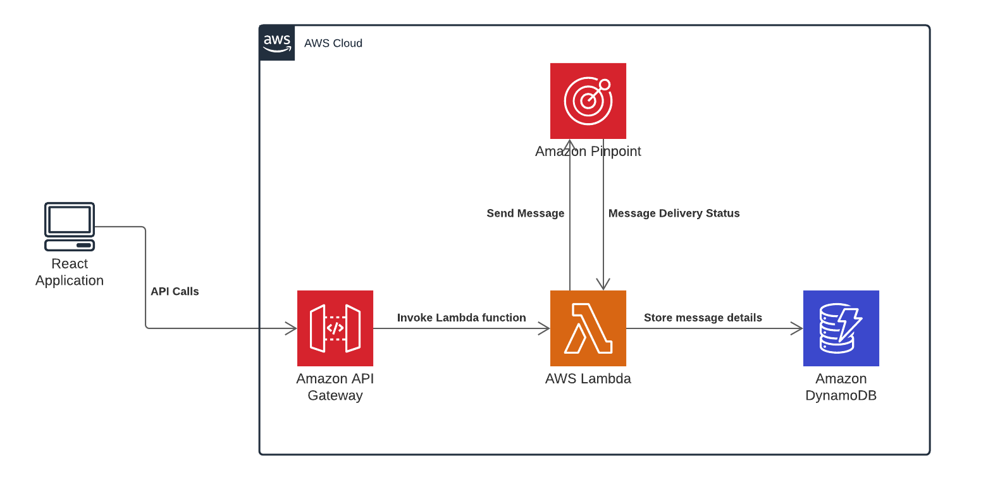

The project is being built using ReactJs on the frontend and AWS Services at the backend. The backend AWS services has been written using Python.

Architecture of the application and the AWS services used can be found in architecture.png.

The front end part of the code consists of the following components

1. **App.js** - This component mainly consists the Route component of 'react-router-dom' which is mainly helps to build a react application enabling navigation among various components
2. **Header.js** - This component is mainly used to display the toolbar with the options for the user to either navigate between send sms and history tabs.
3. **Send.js** - This component mainly displays the view enabling the user to enter the required details to send the sms.
4. **History.js** - This component mainly displays the history of all the sms sent along with the status.

The Material UI (https://material-ui.com/) library has been used to render the UI.
In order to perform the Get and Post requests, Axios (https://www.npmjs.com/package/axios) npm package has been used.

The Lambda functions can be found in the '**Lambda Functions**' folder

# Steps to run the code

To run the code, navigate to the root directory (sms-app) of the project

1. Install the dependencies using `npm install`.
2. Run the code in your localhost using `npm start`.

The app has already been hosted using AWS Amplify and can be found on https://master.d15rkinftbj6e2.amplifyapp.com/
